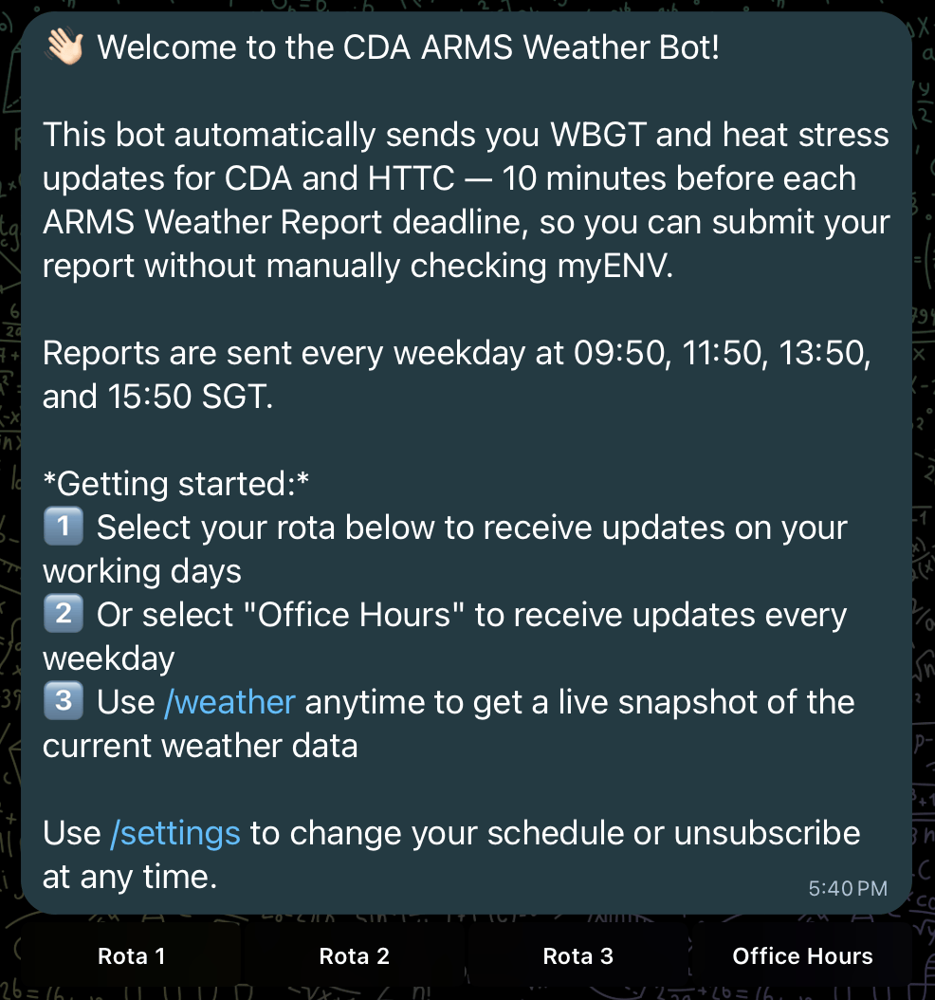
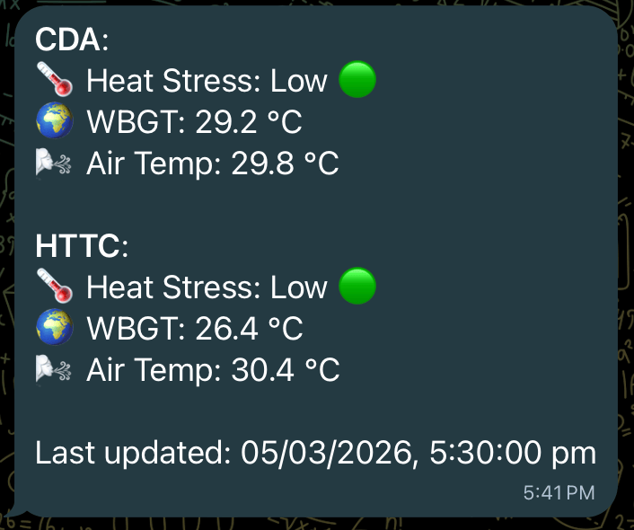
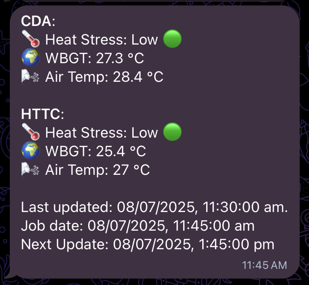

# CDA Weather ARMS Bot

Telegram bot that sends scheduled and on-demand weather updates for CDA and HTTC so ARMS weather reporting is faster and does not require manually checking myENV each time.

If you want to start using the bot as an end user, use the GitHub guide:

- [Getting Started (User Guide)](https://github.com/nabilridhwan/CDAWeatherARMSTelegramBot/wiki/Getting-Started-(User-Guide))

## User Guide And Screenshots

For setup and usage, start with the [Getting Started (User Guide)](https://github.com/nabilridhwan/CDAWeatherARMSTelegramBot/wiki/Getting-Started-(User-Guide)).

| Welcome | `/weather` | Scheduled update |
| --- | --- | --- |
|  |  |  |

## Disclaimer

This project is built out of personal interest only.

It has no affiliation with, and is not endorsed by:

- Civil Defence Academy (CDA)
- National Environment Agency (NEA)
- Singapore Civil Defence Force (SCDF)

## Purpose

The bot exists to do one narrow job reliably:

- fetch live WBGT and air temperature data for CDA and HTTC
- send scheduled Telegram updates before ARMS reporting deadlines
- let users subscribe by rota or office-hours schedule
- let users request an on-demand weather snapshot with `/weather`

Operationally, it also exposes:

- `POST /telegram-webhook`
- `GET /health`
- `GET /logs`

## Tech Stack

- **Language**: TypeScript
- **Runtime**: Node.js
- **Telegram bot framework**: Telegraf
- **HTTP server**: Express
- **Scheduler**: node-schedule
- **Persistence**: Redis via `ioredis`
- **Weather data source**: data.gov.sg weather APIs
- **Environment validation**: `@t3-oss/env-core` + `zod`
- **Logger**: Winston
- **API retry handling**: `axios-retry`
- **Outbound message queue and rate limiting**: `p-queue`
- **Test framework**: Vitest
- **Containerization**: Docker
- **Deployment target config**: Fly.io via `fly.toml`

## Maintainer Mental Model

The project is intentionally split by responsibility:

- `index.ts` is the process entrypoint and HTTP host.
- `bot.ts` is the bot composition root and scheduler wiring.
- `api/` contains integrations with external systems.
- `utils/bot/` contains Telegram-facing behavior and outbound delivery logic.
- `utils/schedule/` contains rota and schedule domain logic.
- `utils/infra/` contains shared environment and logging setup.
- `utils/security/` contains webhook token generation helpers.

The important runtime flow is:

1. `index.ts` validates env, ensures a webhook secret exists, starts Express, and starts the bot runtime.
2. `bot.ts` creates the Telegraf bot, registers handlers, and creates the scheduled job.
3. When the schedule fires, `bot.ts` acquires a Redis lock so multiple instances do not send duplicate messages.
4. Recipient chat IDs are resolved from Redis using the run date plus rota logic.
5. `WeatherReportSender` fetches weather data once, formats one reply, and fan-outs sends through a rate-limited queue.

## Important Design Patterns

These are the patterns worth preserving because they shape how the bot stays predictable and maintainable.

### 1. Composition root at startup

`bot.ts` centralizes runtime construction in `startBot()`.

- `createBot()` builds the Telegraf instance
- `createJob()` builds the scheduler job
- `registerHandlers()` wires commands and callback actions

Why it matters:

- startup side effects stay explicit
- testing and future refactors are simpler
- imports do not accidentally start background jobs

### 2. Factory-style runtime creation

The bot and scheduler are created through functions instead of module-level singletons.

Why it matters:

- startup order is clear
- runtime objects are easier to replace in tests
- infra setup is not hidden at import time

### 3. Lazy singleton for Redis

`api/redis.api.ts` exposes `getRedisClient()` and initializes Redis once.

Why it matters:

- one shared connection is reused
- Redis access stays centralized
- connection setup is consistent across the app

### 4. Domain separation by module

The codebase separates concerns cleanly:

- weather fetching/parsing in `api/weather.api.ts`
- subscription persistence in `api/redis.api.ts`
- message formatting in `utils/bot/replies.ts`
- send queue and Telegram retry behavior in `utils/bot/weatherReportSender.ts`
- rota math in `utils/schedule/rota.ts`

Why it matters:

- you can change one behavior without touching unrelated layers
- future bugs are easier to localize

### 5. Distributed lock for scheduled sends

Scheduled jobs use a Redis lock keyed by minute slot.

Why it matters:

- prevents duplicate weather blasts when more than one app instance is running
- keeps horizontal deployment safe

### 6. Queue-based outbound delivery

All Telegram sends go through a shared `PQueue` in `utils/bot/weatherReportSender.ts`.

Why it matters:

- outbound traffic is rate-limited
- scheduled sends do not burst too hard against Telegram
- both scheduled and on-demand sends use the same delivery path

### 7. Retry only around transient failures

There are two retry layers:

- data.gov requests retry in `api/weather.api.ts`
- Telegram send/edit operations retry in `utils/bot/weatherReportSender.ts`

Why it matters:

- transient network and `429`/`5xx` failures are tolerated
- permanent failures are not retried forever
- retry rules are centralized instead of scattered through handlers

### 8. Environment validation at process edge

`utils/infra/env.ts` validates env vars at startup.

Why it matters:

- missing configuration fails fast
- downstream modules can assume typed config exists

## Where To Change What

Use this as the first place to look before editing.

### Bot behavior

- Add or change Telegram commands and callback actions: `bot.ts`
- Change welcome/help/settings wording: `utils/bot/replies.ts`
- Change Markdown escaping or weather message layout: `utils/bot/replies.ts`

### Scheduling and rota logic

- Change scheduled send timing or weekdays: `utils/bot/rule.ts`
- Change rota cycle order, anchor date, or "next update" calculation: `utils/schedule/rota.ts`
- Change which subscribers receive a scheduled run: `api/redis.api.ts`

### Weather data logic

- Change data source URLs, retry policy, or request timeout: `api/weather.api.ts`
- Change closest-station selection logic: `api/weather.api.ts`
- Change CDA/HTTC coordinates or location defaults: `api/weather.api.ts`

### Subscription storage

- Change Redis key structure or environment prefixes: `utils/schedule/rota.ts`
- Change subscription reads/writes and lock behavior: `api/redis.api.ts`

### Telegram sending reliability

- Change queue concurrency / rate limits: `utils/bot/weatherReportSender.ts`
- Change Telegram retry conditions or retry backoff: `utils/bot/weatherReportSender.ts`
- Change how on-demand `/weather` edits the loading message: `utils/bot/weatherReportSender.ts`

### HTTP/server behavior

- Change webhook middleware, `/health`, `/logs`, or shutdown flow: `index.ts`
- Change webhook secret token generation fallback: `utils/security/generateSecretToken.ts`

### Infra and operations

- Change env schema or required variables: `utils/infra/env.ts`
- Change logging format or log destinations: `utils/infra/logger.ts`
- Change deployment container settings: `Dockerfile`
- Change Fly deployment settings: `fly.toml`

### Tests

- Weather API tests: `tests/api/weather.test.ts`
- Reply formatting tests: `tests/utils/replies.test.ts`
- Rota/date logic tests: `tests/utils/getNextUpdateDateForRota.test.ts`, `tests/utils/getRotaNumber.test.ts`

## Current Schedule Model

Schedule definition lives in `utils/bot/rule.ts`.

- weekdays only
- `09:50`, `11:50`, `13:50`, `15:50`
- Singapore timezone

Rota logic lives in `utils/schedule/rota.ts`.

- reference date: `2025-10-06T00:00:00+08:00`
- reference rota on that date: `Rota 3`
- cycle order: `3 -> 2 -> 1 -> 3 -> ...`

For each scheduled send:

- all `office_hours` subscribers are included
- the matching rota for that run date is included
- chat IDs are de-duplicated before sending

## Repository Map

- `index.ts`: app entrypoint, Express server, webhook setup, health/log endpoints, shutdown flow
- `bot.ts`: bot runtime construction, handlers, scheduled job
- `api/redis.api.ts`: Redis client access, subscriptions, distributed lock
- `api/weather.api.ts`: weather fetch, parsing, closest-station logic, retries
- `utils/bot/replies.ts`: reply templates and weather message formatting
- `utils/bot/weatherReportSender.ts`: queue-based Telegram delivery and retries
- `utils/bot/rule.ts`: recurrence rule for scheduled sends
- `utils/schedule/rota.ts`: rota cycle math and Redis key helpers
- `utils/infra/env.ts`: env validation
- `utils/infra/logger.ts`: logger setup
- `utils/security/generateSecretToken.ts`: webhook secret generation

## Development Notes

If you are changing behavior, run:

```bash
npm test
npm run build
```

If you only want to learn how to run or use the bot as an end user, use the GitHub guide:

- [Getting Started (User Guide)](https://github.com/nabilridhwan/CDAWeatherARMSTelegramBot/wiki/Getting-Started-(User-Guide))
