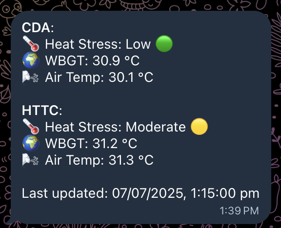

# CDA Weather ARMS Telegram Bot
> A Telegram bot that provides weather information for CDA and HTTC at 09:45, 11:45, 13:45 and 15:45 on Weekdays.



## Features
- Provides weather information for CDA and HTTC.
- Sends weather updates at 09:45, 11:45, 13:45 and 15:45 on weekdays.
- Uses the same weather data from myENV app.
- Get instant weather updates by sending `/weather` command.

## Technologies Used
- Node.js
- Redis
- Telegram Bot API (via Telegraf)
- Fly.io (Deployed on)

## APIs Used
- [Wet Bulb Globe Temperature (WBGT) API](https://data.gov.sg/datasets/d_87884af1f85d702d4f74c6af13b4853d/view)
- [Air Temperature across Singapore API](https://data.gov.sg/datasets/d_66b77726bbae1b33f218db60ff5861f0/view)

## Get started
1. Click on the link below to add the bot to your Telegram:
   [Add Bot](https://t.me/cda_weather_arms_bot)
2. Send `/start` command to the bot.
3. Everything should be configured and ready to use. The bot will send you weather updates at the specified times.
4. To get the current weather, send `/weather` command to the bot.

## Contributing
If you want to contribute to this project, feel free to open an issue or submit a pull request. Contributions are welcome!
Setup:
1. Clone the repository:
   ```bash
   git clone
   ```
2. Install the required dependencies:
   ```bash
   yarn
    ```
3. Duplicate the `.env.example` file and rename it to `.env` and fill in the required environment variables.
4. Start the bot:
   ```bash
   yarn start
   ```